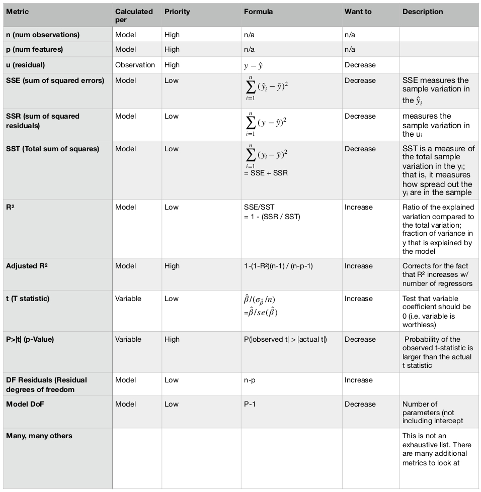

# Meta

## Audience

 - Familiar w/ OLS, would like cheat sheet
 - Learning OLS, need learning material
 - Unfamiliar w/ OLS. Need human language cheat sheet

## Goals

## Lit review

 - [DS curriculum slides](https://github.com/thisismetis/dscurriculum_beta/blob/master/class_lectures/week03-luther2/02-null_hypo_eval/Linear_Model_Evaluation.pdf)
 - [Robert's slides]() - None
 - [Zach's slides]() - None
 - Wooldridge: 37 - 40
 - [Statsmodels example](http://www.statsmodels.org/dev/examples/notebooks/generated/ols.html)

### [DS curriculum slides](https://github.com/thisismetis/dscurriculum_beta/blob/master/class_lectures/week03-luther2/02-null_hypo_eval/Linear_Model_Evaluation.pdf)

 - From Statsmodels point of view
 - Residuals DoF: observations - # free parameters
 - Model DoF: number of parameters - 1
 - R2: 1- (SSE/SST). Portion of unexplained variance
 - SSE: Sum squared errors
 - TSS: Sum squared totals
 - F statistic (skip)
 - T statistic and P value. P value for hyp test, h_0 is that B is actually zero. Want small p
 - Omnibus: Test that errors are normally distributed. Want small p
 - Examples for testing

# Outline

## Intro

 - Primarily working in non-linear models
 - OLS is incredibly common and well studied
 - Designed for my reference, helpful for others
 - Be careful w/ choice of metric

## Cheat sheet

### Correcting issues

What happens when your metrics aren't where you'd like them to be? Then, the hunt is afoot!

While model building is more of an art than a science, below are a few helpful (priority ordered) approaches to improving models. 

 - Trying another algorithm
 - Using regularization (lasso, ridge or elasticnet)
 - Changing functional forms for each feature (e.g. log scale, inverse scale)
 - Adding polynomial terms
 - Including other features
 - Using more data (bigger training set)
